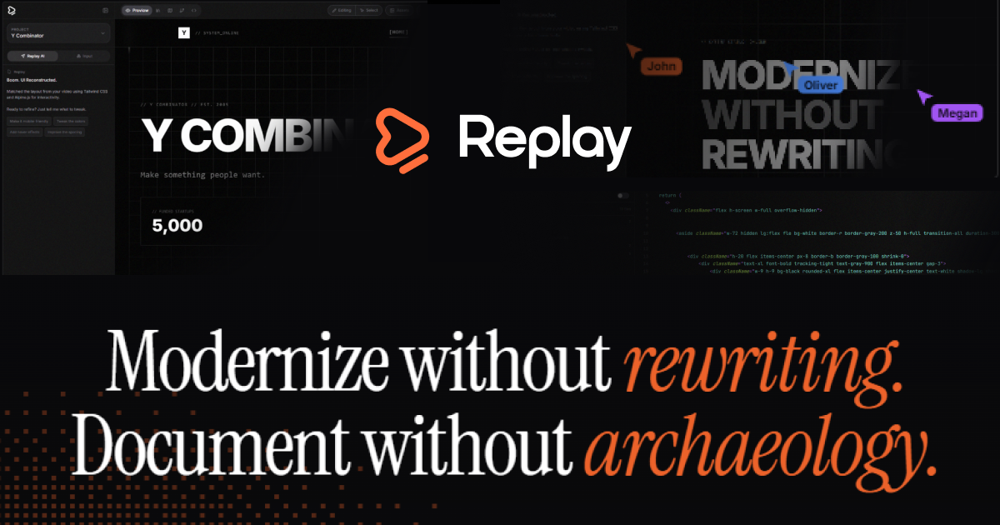

# 🎬 Replay

<div align="center">



### **Modernize without rewriting. Document without archaeology.**

Replay reconstructs working UI from video recordings. Transform legacy software into production-ready React code with Design System and Component Library.

[](https://replay.build)
[](https://replay.build/docs)
[](https://nextjs.org)
[](https://ai.google.dev)

</div>

---

## ✨ What is Replay?

Replay reconstructs production-ready UI from video recordings. No manual documentation, no reverse-engineering. Upload a screen recording of any legacy app and Replay will:

1. **Reconstruct UI** — AI analyzes video and generates pixel-perfect React code
2. **Extract Design System** — Colors, typography, spacing tokens from the actual interface
3. **Build Component Library** — Storybook-style docs with controls, variants, and usage examples
4. **Visualize Flows** — See detected pages and navigation patterns
5. **One-Click Publish** — Deploy working UI to the web instantly

---

## 🤖 AI Architecture: The Sandwich Model

Replay uses a sophisticated multi-model AI pipeline we call the **"Sandwich Architecture"**:

### 🔍 Phase 1: Surveyor (Gemini 3 Flash)
**"Measure twice, cut once"**
- Extracts precise layout measurements from video frames
- Detects grid systems, spacing patterns, color palettes
- Identifies navigation type (sidebar, top menu, tabs)
- Uses code execution for pixel-accurate measurements
- Outputs structured JSON with hard data, not guesses

### ⚡ Phase 2: Generator (Gemini 3 Pro)
**Main code generation**
- Receives Surveyor measurements as context
- Generates production-ready React + Tailwind code
- Preserves exact colors, typography, and layouts
- Creates interactive components with working navigation
- Outputs complete single-file React application

### ✅ Phase 3: QA Tester (Gemini 3 Flash)
**Visual verification**
- Compares generated UI against original video frames
- Calculates SSIM (Structural Similarity Index)
- Identifies diff regions requiring fixes
- Provides auto-fix suggestions for mismatches
- Ensures pixel-perfect output

---

## 🆕 Recent Updates (v2.6.0 - Feb 21, 2026)

### 🤖 LLM Discoverability (llms.txt)
- **AI Agent Indexing** — Added `llms.txt` and `llms-full.txt` for AI assistants (ChatGPT, Claude, Perplexity, Gemini) to read Replay's complete product documentation in a single file.
- **Permissive Crawling** — robots.txt allows all major AI crawlers (GPTBot, ClaudeBot, PerplexityBot, GoogleOther, Amazonbot).
- **AI-Native Metadata** — Title, description, and keywords optimized for AI recommendation engines.

### 🔄 Seamless Marquee / Scrolling Text
- **Infinite Loop Fix** — All generation prompts enforce seamless marquee loops with duplicated items + `translateX(-50%)`. No more visible gaps or restarts in scrolling text.

### 🛡️ Edit Mode Anti-Corruption
- **Truncation Detection** — AI editor detects and rejects truncated Tailwind class names (`flex-col`→`fle`, `max-w-[1400px]`→`ma[1400px]`). Corrupted edits preserve original code.
- **Alpine.js Protection** — Editor prompts forbid removing Alpine.js directives (`x-data`, `x-show`, `x-collapse`, `@click`) during edits.

### 👁️ Text Visibility & Hero Overflow
- **Outline Text Readability** — `text-stroke`/`text-outline` requires minimum opacity-60.
- **Hero Containment** — Hero headlines enforce `overflow-hidden` + `max-w-full` + responsive sizing.

[See full changelog →](https://replay.build/docs/changelog)

---

## ⚡ Replay vs Alternatives

| Feature | **Replay** | Lovable | Bolt.new | v0 (Vercel) | Builder.io |
|---------|-----------|---------|----------|-------------|------------|
| **Input** | Video recording | Text prompt | Text prompt | Text/image prompt | Figma/screenshot |
| **Captures interactions** | Yes (hover, click, scroll) | No | No | No | No |
| **Captures animations** | Yes (transitions, parallax) | No | No | No | No |
| **Multi-page detection** | Yes (auto from video) | No | No | No | No |
| **Design System extraction** | Yes (colors, fonts, spacing) | No | No | No | Partial |
| **Component Library** | Yes (5-layer taxonomy) | No | No | No | No |
| **Accuracy to original** | ~90% (pixel-level) | ~30% | ~30% | ~40% | ~50% |
| **Output** | React + Tailwind + GSAP | React | Multi-framework | React | Multi-framework |

**Why video beats text prompts:** Text prompts require you to *describe* a UI. Video lets AI *observe* the real thing — layout, colors, typography, interactions, animations, and content. No prompt engineering needed.

---

## 🎯 Core Features

### 📚 Component Library
A Storybook-like interface for your extracted components:
- **Controls** — Edit props in real-time (colors, text, sizes)
- **Actions** — See interactive behaviors  
- **Visual Tests** — Compare component states
- **Accessibility** — WCAG compliance checks
- **Usage** — Copy-paste code snippets

### 🎨 Editor
Visual canvas for component composition:
- Drag & drop components on canvas
- Resize and position freely
- AI-powered editing: "Make it red", "Add icon", "Add shadow"
- Real-time preview in iframe
- Save to library when satisfied

### 🗺️ Flow Map
Interactive visualization of app structure:
- Detected pages and navigation paths
- Click nodes to preview pages
- See relationships between screens
- Path Structure showing components per page
- Export as documentation

### 🔗 Database Integration
Connect Supabase and generate real data-fetching code:
- AI reads your table schemas
- Generates actual queries (not mock data)
- Supports authentication patterns

### 🚀 One-Click Publish
Deploy instantly to `replay.build/p/your-project`

---

## 🛠️ Tech Stack

| Layer | Technology |
|-------|------------|
| **Framework** | Next.js 14 (App Router) |
| **Styling** | Tailwind CSS 3.4 |
| **AI Models** | Google Gemini 3 Pro (generation) |
| **AI Vision** | Google Gemini 3 Flash (Agentic Vision) |
| **Database** | Supabase (PostgreSQL) |
| **Auth** | Supabase Auth (Google OAuth) |
| **Payments** | Stripe |
| **Hosting** | Vercel |
| **Realtime** | Liveblocks (collaboration) |
| **Icons** | Lucide React |
| **Color Picker** | @uiw/react-color |

---

## 💰 Pricing

| Plan | Price | Credits/Month | Best For |
|------|-------|---------------|----------|
| **Sandbox** | $0 | 0 (demo only) | Explore the app |
| **Pro** | $19/mo | 1,500 | Freelancers |
| **Agency** | $99/mo | 15,000 | Teams (5 members) |
| **Enterprise** | Custom | Custom | Banks & enterprise |

**Credit Costs:**
- 🎬 Video generation: **~150 credits**
- ✨ AI edit: **~10 credits**

---

## 🚀 Quick Start

### Option 1: Use the Live App
👉 **[replay.build](https://replay.build)**

### Option 2: Self-Host

#### Prerequisites
- Node.js 18+
- Supabase account
- Stripe account  
- Google AI Studio API key (Gemini 3)

#### 1. Clone & Install

```bash
git clone https://github.com/ma1orek/replay.git
cd replay
npm install
```

#### 2. Setup Environment

```bash
cp env.example .env.local
```

Fill in your `.env.local`:

```env
# Supabase
NEXT_PUBLIC_SUPABASE_URL=https://your-project.supabase.co
NEXT_PUBLIC_SUPABASE_ANON_KEY=your_anon_key
SUPABASE_SERVICE_ROLE_KEY=your_service_role_key

# Stripe
STRIPE_SECRET_KEY=sk_live_...
STRIPE_WEBHOOK_SECRET=whsec_...
STRIPE_PRO_PRICE_ID_MONTHLY=price_...
STRIPE_PRO_PRICE_ID_YEARLY=price_...

# Gemini AI (Gemini 3 Pro & Flash)
GEMINI_API_KEY=your_gemini_api_key

# App URL
NEXT_PUBLIC_APP_URL=http://localhost:3000
```

#### 3. Setup Supabase

Run the migration in Supabase SQL Editor:
```sql
-- See supabase/migrations/001_initial_schema.sql
```

Enable Google OAuth in Authentication → Providers.

#### 4. Run

```bash
npm run dev
```

Open [http://localhost:3000](http://localhost:3000)

---

## 📁 Project Structure

```
replay/
├── app/
│   ├── api/
│   │   ├── generate/        # AI generation endpoints
│   │   │   ├── library/     # Component extraction
│   │   │   ├── blueprints/  # Blueprint AI editing
│   │   │   └── stream/      # Streaming generation
│   │   ├── blueprint/       # Agentic Vision endpoints
│   │   │   ├── vision/      # Surveyor (measurements)
│   │   │   ├── vision-qa/   # QA Tester (verification)
│   │   │   └── edit/        # AI component editing
│   │   ├── credits/         # Credit management
│   │   ├── publish/         # Deployment endpoint
│   │   └── stripe/          # Payment webhooks
│   ├── docs/                # Documentation pages
│   ├── page.tsx             # Main tool interface
│   └── layout.tsx           # Root layout
├── components/
│   ├── ui/                  # Shadcn-style UI components
│   │   ├── color-picker.tsx # Advanced color picker
│   │   ├── popover.tsx
│   │   └── ...
│   └── modals/              # Auth, credits modals
├── lib/
│   ├── agentic-vision/      # Sandwich Architecture prompts
│   │   └── prompts.ts       # Surveyor, Generator, QA instructions
│   ├── supabase/            # Database clients
│   ├── prompts/             # AI system prompts
│   └── utils.ts             # Helpers
└── public/
    └── imgg.png             # Social preview (OG image)
```

---

## 🔒 Security

- ✅ Row Level Security (RLS) on all Supabase tables
- ✅ Server-side credit transactions (atomic)
- ✅ Stripe webhook signature verification
- ✅ Service role keys only on server
- ✅ Sandboxed iframe previews

---

## 🗺️ Roadmap

- [x] Video to UI generation
- [x] Component Library with Controls
- [x] Visual Editor (formerly Blueprints)
- [x] Flow Map visualization
- [x] AI editing with chat interface (SEARCH/REPLACE + Full HTML modes)
- [x] Color picker with contrast ratio
- [x] One-click publish with cache-busting
- [x] Supabase integration
- [x] Version history
- [x] Agentic Vision (Sandwich Architecture)
- [x] Gemini 3 Pro & Flash integration
- [x] Design System import from Storybook
- [x] 40+ style presets (including Rive interactive)
- [x] React Bits component library (130+ components)
- [x] Enterprise Library taxonomy (5-layer)
- [x] REST API v1 (generate, scan, validate endpoints)
- [x] MCP Server for AI agents (Claude Code, Cursor, etc.)
- [x] LLM discoverability (llms.txt, AI-native metadata)
- [ ] Figma plugin export
- [ ] Team collaboration
- [ ] Component marketplace

---

## 🔌 API & MCP Server

Replay is available as a REST API and MCP server for AI agents.

### REST API

```bash
# Generate React code from video
curl -X POST https://replay.build/api/v1/generate \
  -H "Authorization: Bearer rk_live_..." \
  -H "Content-Type: application/json" \
  -d '{"video_url": "https://example.com/recording.mp4"}'
```

| Endpoint | Description | Credits |
|----------|-------------|---------|
| `POST /api/v1/generate` | Video → React + Tailwind code | 150 |
| `POST /api/v1/scan` | Video → UI structure JSON | 50 |
| `POST /api/v1/validate` | Code + Design System → errors | 5 |

### MCP Server (Claude Code, Cursor, etc.)

```json
{
  "mcpServers": {
    "replay": {
      "command": "npx",
      "args": ["@replay-build/mcp-server"],
      "env": { "REPLAY_API_KEY": "rk_live_..." }
    }
  }
}
```

Get your API key at [replay.build/settings?tab=api-keys](https://replay.build/settings?tab=api-keys).

---

## 📖 Documentation

Full documentation at **[replay.build/docs](https://replay.build/docs)**

- [Quickstart Guide](https://replay.build/docs/quickstart)
- [Component Library](https://replay.build/docs/features/library)
- [Editor](https://replay.build/docs/features/blueprints)
- [Flow Map](https://replay.build/docs/features/flow-map)
- [AI Editing](https://replay.build/docs/features/edit-with-ai)
- [Publishing](https://replay.build/docs/features/publish)
- [API Reference](https://replay.build/docs/api)

---

## 🤝 Contributing

Contributions welcome!

1. Fork the repository
2. Create your feature branch (`git checkout -b feature/amazing`)
3. Commit your changes (`git commit -m 'Add amazing feature'`)
4. Push to the branch (`git push origin feature/amazing`)
5. Open a Pull Request

---

## 📄 License

MIT License - see [LICENSE](LICENSE) for details.

---

## 🙏 Acknowledgments

- [Next.js](https://nextjs.org) — React framework
- [Supabase](https://supabase.com) — Database & Auth
- [Google Gemini 3](https://ai.google.dev) — AI generation (Pro & Flash models)
- [Tailwind CSS](https://tailwindcss.com) — Styling
- [Lucide](https://lucide.dev) — Icons
- [Vercel](https://vercel.com) — Hosting
- [Liveblocks](https://liveblocks.io) — Realtime collaboration

---

<div align="center">

**Built with ❤️ by Replay Team**

[Live Demo](https://replay.build) · [Documentation](https://replay.build/docs) · [Report Bug](https://github.com/ma1orek/replay/issues)

</div>
